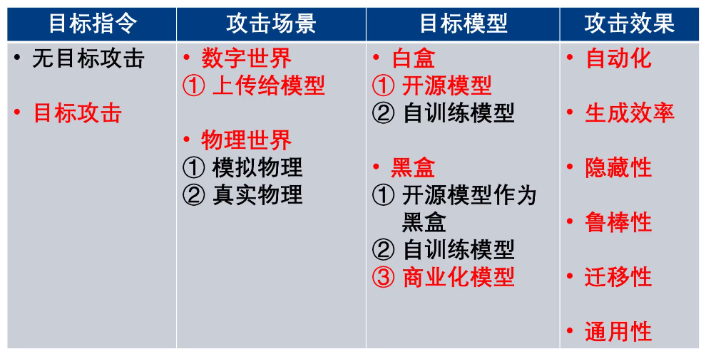
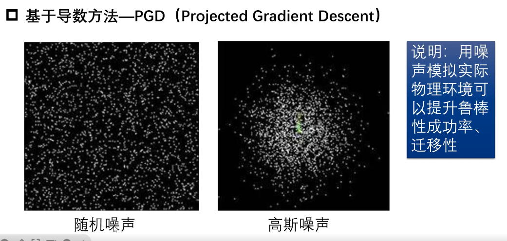
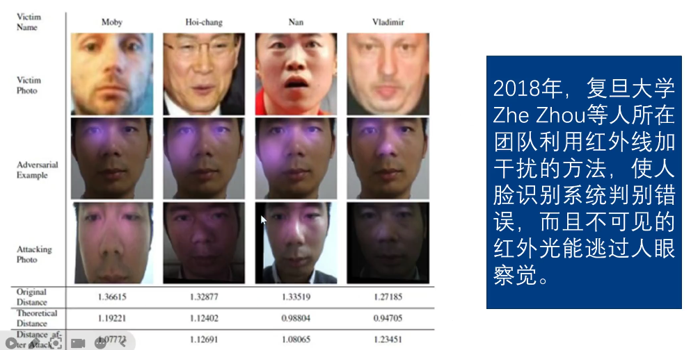
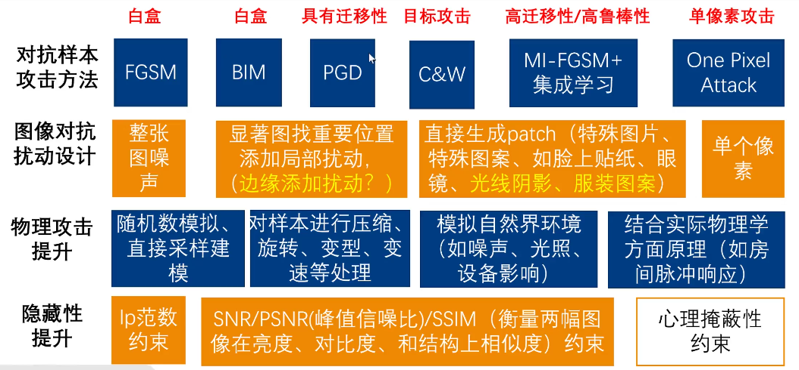

# 对抗样本攻击与防御

## 对抗样本典型时间、

### 分类边界

### 对抗样本

### 攻击分类

## 对抗样本理论基础

### 对抗样本攻击评估方面

### 扰动噪声样例

### 对抗样本攻击原理

### 白盒攻击

## 对抗样本攻击防御

## 对抗样本攻防实践

## Github项目

### DeepRobust

https://github.com/DSE-MSU/DeepRobust/tree/master

> DeepRobust is a PyTorch adversarial library for attack and defense methods on images and graphs.

已经克隆到桌面，安装到conda环境ctf中，具体使用方法可以查看README文件

好多以来问题，没装上。。。