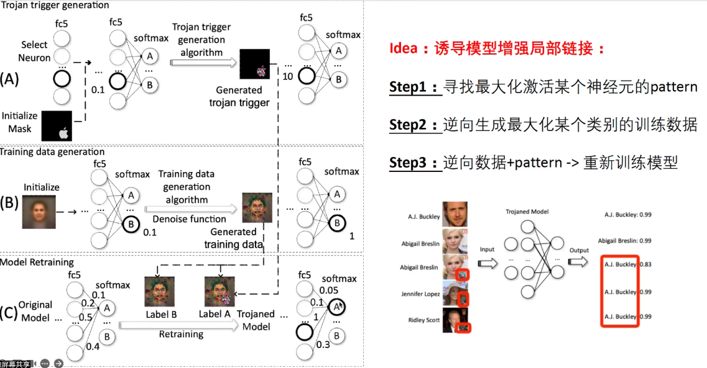
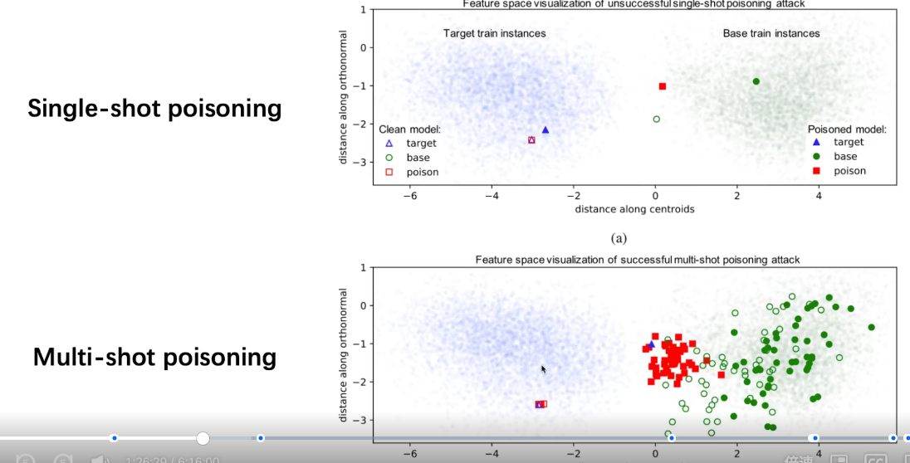
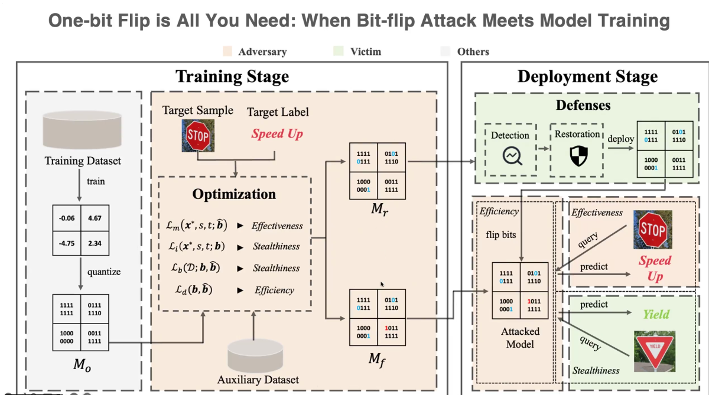

# 模型后门和数据投毒

## 模型后门和数据投毒概念

​	数据投毒发生在模型训练阶段

### 按攻击面分类

1. Outsourcing Attack
2. Pretrained Attack
3. Data Colletion Attack
4. Collaborative Learning Attack
5. Post-deployment Attack
6. Code Poisoning Attack

​	数据投毒是实现后门攻击的主要手段。

## 模型后门和数据投毒原理

### Outsourcing Attack

​	将模型训练任务交给第三方机构(MLaaS,Machine Learning as a Service)

​	第三方在数据集中添加脏数据进行投毒(Dirty Lable Attack)。

### Pretrained Attack

​	开发者使用攻击者的发布含有后门的模型。

### Data Collection Attack

​	可以使用Cleab lable进行数据投毒。

​	模型后门和数据投毒防御

#### 攻击方式

##### Transfer Learning

​	Freeze all previous layers and only train the final layer.

##### End-to-end Training

​	All weights are re-trained from scratch

##### 其他攻击技术

### Collaborative Learning Attack

#### Distributed Backdoor Attack

### Post-Deployment Attack

### Code Poisoning Attack

## 模型后门和数据投毒防御

​	

## 数据投毒攻防实践

重要指标：

1. ASR：后门数据攻击成功率
2. CDA：干净样本准确率

老师推荐TrojanZoo和BackdoorBox

