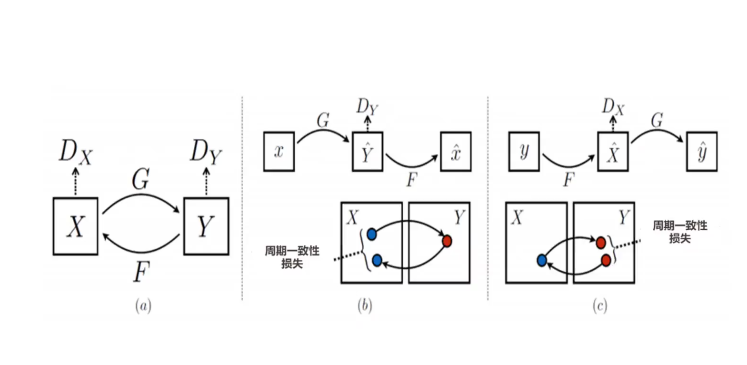
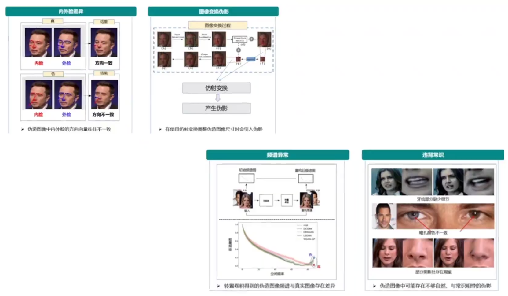
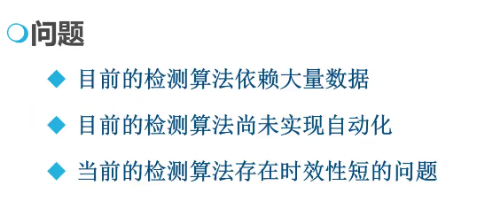

# 深度伪造攻防

## 深度伪造背景

​	深度伪造(Deepfake)=深度学习(Deep learning)+创建或合成视听觉内容(Fake)

## 深度伪造方法

### 视觉深度伪造

目标：高视觉质量(高分辨率、动作自然)和应用灵活性(声音驱动、文本驱动)

#### 人脸伪造方式--身份or属性特征篡改

1. 人脸合成
2. 人脸操纵
   1. 人脸重演
   2. 人脸替换
   3. 人脸编辑
3. 姿态要素篡改
4. 纹理要素篡改
5. 人脸图像->成分篡改
   1. 直射光照
   2. 氛围光照
   3. 3D人脸结构
   4. 个性纹理
   5. 共有纹理
   6. 精细结构

#### 代表性图像深度伪造方法

##### 基于GAN(深度对抗网络)

###### 生成器--鉴别器攻防对抗，达到某种平衡

##### 基于DCGAN

###### GAN+CNN,解决GAN架构不稳定和训练不稳定的问题

##### 基于Cycle-GAN

###### 以DCGAN分别作为生成器和鉴别器

### 音频深度伪造

#### 文字转语言

#### 音色转换

#### 基于自回归模型

#### 基于声码器

#### 基于参数估计

#### 基于交互场景的多风格

### 视频深度伪造

#### 基于Facawap-GAN

#### 基于变分自编码器

#### 基于双重视频鉴别器

​	空间鉴别器+时间鉴别器

### 总结

#### 数据收集

#### 模型训练

#### 伪造内容生成

##  深度伪造检测方法

### 图像深度伪造检测

#### 基于真伪图像特征差异比对

##### 伪特征网络模型

##### 基于原数据特征检测

##### 基于图像面部特征点特征

##### 基于新型通用的伪特征网络

#### 基于CNN架构定制修改

##### 定制化修改CNN架构和损失函数

##### FakeSpotter模型框架

##### 基于GAN指纹特征

##### 基于多级特征增强

### 音频深度伪造检测方法

#### 基于频谱图

#### 基于多特征融合

### 视频深度伪造检测方法

#### 基于跨视频帧组时序特征

##### 光流法

##### 视频流时空特征分析

#### 基于视频帧内视频伪像

#### 基于时空频多域特征融合

#### 基于人脸对称不一致性

#### 基于区块链

#### 多媒体伪造/鉴伪模型可解释性

### 文本深度伪造检测方法

#### DetectGPT

### 小结

