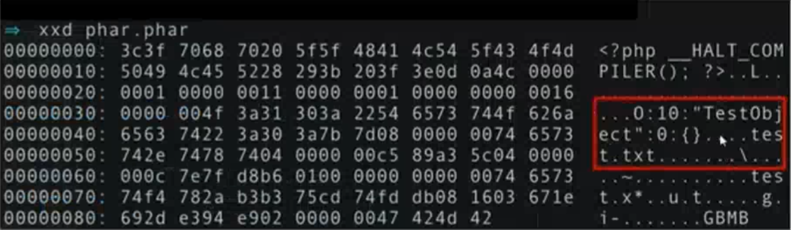
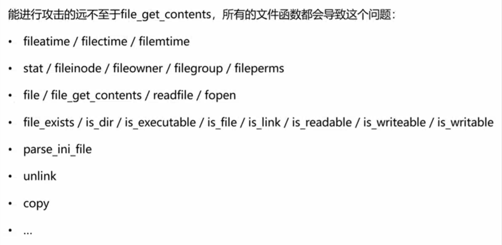

# PHP反序列化

```php
__construct()，类的构造函数
__destruct()，类的析构函数
__call()，在对象中调用一个不可访问方法时调用
__callStatic()，用静态方式中调用一个不可访问方法时调用
__get()，获得一个类的成员变量时调用
__set()，设置一个类的成员变量时调用
__isset()，当对不可访问属性调用isset()或empty()时调用
__unset()，当对不可访问属性调用unset()时被调用。
__sleep()，执行serialize()时，先会调用这个函数
__wakeup()，执行unserialize()时，先会调用这个函数
__toString()，类被当成字符串时的回应方法
__invoke()，调用函数的方式调用一个对象时的回应方法
__set_state()，调用var_export()导出类时，此静态方法会被调用。
__clone()，当对象复制完成时调用
__autoload()，尝试加载未定义的类
__debugInfo()，打印所需调试信息
```

> [!NOTE]
>
> 在命名空间下的php反序列化别忘了添加命名空间相关信息。

## PHP中的Session反序列化

​	Session中的反序列化机制：当session_start()被调用或者php.ini中session.auto_start为1时，PHP内部调用会话管理器，当前访问用户Session被序列化后存储至指定目录，默认为/tmp。

​	PHP处理器的三种序列化方式：

1. `php_binary`：键名的长度对应的ASCII字符+键名+经过serialize()函数序列处理的值。
2. `php`：键名+竖线+经过serialize()函数序列处理的值。
3. `php_serialize`：serialize()函数序列处理数组方式。

​	配置文件php.ini中与session存储配置相关的重要配置项：

1. `session.save_path`设置session的存储路径，默认为/tmp。
2. `session.auto_start`指定会话模块是否在请求开始时启动一个会话，默认为0不启动。
3. `session.serialize_handler`定义用来序列化/反序列化的处理器名字，默认使用php（即第二个序列化方式）。


​	当我们打开支持session的页面中，会从保存的session中进行反序列化来还原页面，及时代码中没有读取操作。

​	漏洞解析：


## Phar反序列化

​	Phar文件：PHAR(PHP归档)文件是一种打包格式，通过将许多PHP代码文件和其他资源(例如图像、样式表等)捆绑到一个归档文件中来实现应用程序和库的分发。所有PHAR文件都使用.phar作为文件拓展名，PHAR格式的归档需要使用自己写的PHP代码。

​	phar://协议：可以将多个文件归入到一个本地文件夹，也可以包含一个文件。

​	PHAR文件结构：

1. a stub

   识别phar拓展的标识，格式:xxx<?php xxx;__HALT_COMPILER();?>。

2. a manifest describing the contents

   被压缩文件的权限、属性等信息都放在这部分。在这部分还会以序列化的形式存储用户自定义的meta-data，这是漏洞利用的核心部分。对应函数Phar::setMetadata设置phar归档元数据。

3. the file contents

   被压缩文件的内容。

4. [optional]a signature for verifying Phar intergrity (phar file format only)

   签名，放在文件末尾。对应函数Phar::stopBuffering停止缓冲对Phar存档的写入请求，并将更改保存到磁盘。

​	想要使用Phar类里的方法，必须在php.ini中将phar.readonly配置项配置为0或off(文档中定义)，php中内置phar类，提供部分操作如下：

```php
$phar = new Phar('phar/hpdoger.phar'); // 实例化一个phar对象供后续操作
$phar->startBuffering() // 开始缓冲Phar写操作
$phar->addFromString('test.php','<?php echo \'this is test file\';'); // 以字符穿的形式添加一个文件到phar档案
$phar->buildFromDirectory('fileToPhar') //把一个目录下的文件归档到phar档案
$phar->extractTo() // 解压一个phar包的函数，extractTo提取phar文档内容
```

a manifest describing the contents => phar文件会以序列化的形式存储用户自定义的meta-data

Phar伪协议 => 不以来unserialize()直接进行反序列化操作，在读取phar文件里的数据时反序列化meta-data，达到操控目的。







以下代码可以实现phar文件的fast destruct

```python
import hashlib

f = open("eastjun.phar", "rb")
data = f.read()
f.close()
length = int(data[47:51][::-1].hex(), 16)
data = data[:51 + length - 1] + b"1" + data[51 + length:len(data) - 28]
data += hashlib.sha1(data).digest()
data += b"\x02\x00\x00\x00GBMB"
f = open("eastjun.phar", "wb")
f.write(data)
f.close()
```

