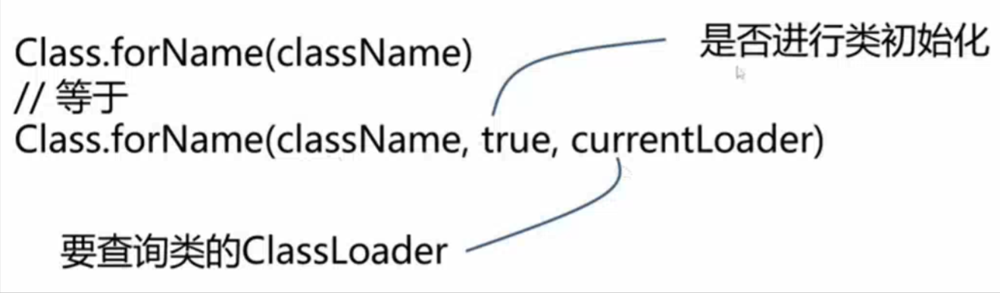

# Java中反射与序列化

## Java反射与序列化的相关基础知识

### Java反射基础知识

​	**反射式编程：**指计算机程序运行时(runtime)可以访问、检测和修改它本身状态或行为的一种能力。

​	常见函数：

1. 获取类对象：forName
2. 实例化类对象：newInstance
3. 获取类方法：getMethod
4. 执行方法：invoke

​	获取类对象(java.lang.Class)：

1. object.getClass()

   如果上下文存在某个类的实例

2. TargetClass.class

   如果已经加载了这个类

3. Class.forName()

   知道目标类的名字

## Java序列化原理

​	最重要的两个函数：

1. readObject()：反序列化函数
2. writeObject()：序列化函数

